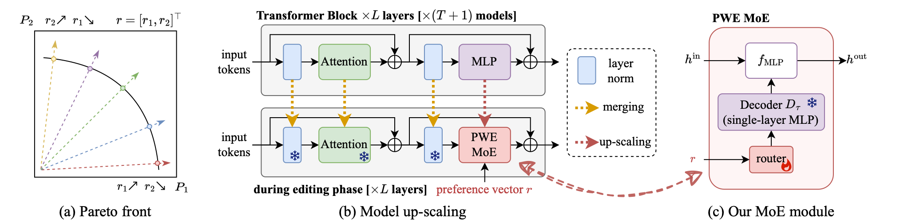

# Towards Efficient Pareto Set Approximation via Weight-Ensembling Mixture of Experts



## How to reproduce the results:

for CLIP models:

1. Download checkpoints from [Google Drive](https://drive.google.com/drive/folders/1u_Tva6x0p6oxu5Eo0ZZsf-520Cc_3MKw?usp=share_link).
2. The running scripts are placed at `scripts` directory, or you can run `bash clip_pareto_moe.sh <method> <version>`. 
    The method can be `moe_ls`, and `moe_epo`.
    For detailed hyperparameter configuration of different verisons, please refer to the bash script.
    > for LS, EPO, and MGDA, see `clip_mtl.sh`
3. the results would be saved at `results` directory.

for GPT-2 models:

1. Download chekpoints form HuggingFace, fine-tuned checkpoints would be available after double-blind review.
    > the fine-tuning scripts are also provided, you can fine-tune the model on specific task.
    such as `python scripts/gpt2_finetune.py --dataset qqp`.
2. The running scripts are placed at `scripts` directory, or you can run `bash gpt2_pareto_moe.sh <method> <version>`. 
   The method can be `moe_ls`, and `moe_epo`.
   For detailed hyperparameter configuration of different verisons, please refer to the bash script.
   > for other baselines, see `gpt2_merge.sh`
3. The results would be saved at `results` directory.

For DDP training, pass `--num_devices <num_devices>` as arguments.
for example, `bash gpt2_pareto_moe.sh moe_ls 6 --num_devices 4`.

For GPT-2 model with DDP training, you need to modify the file `site-packages/transformers/models/gpt2/modeling_gpt2.py`

```python
attn_weights = torch.where(causal_mask, attn_weights.to(attn_weights.dtype), mask_value)

# clone the tensor to avoid in-place operation error 
attn_weights = torch.where(causal_mask.clone(), attn_weights.to(attn_weights.dtype), mask_value)
```

